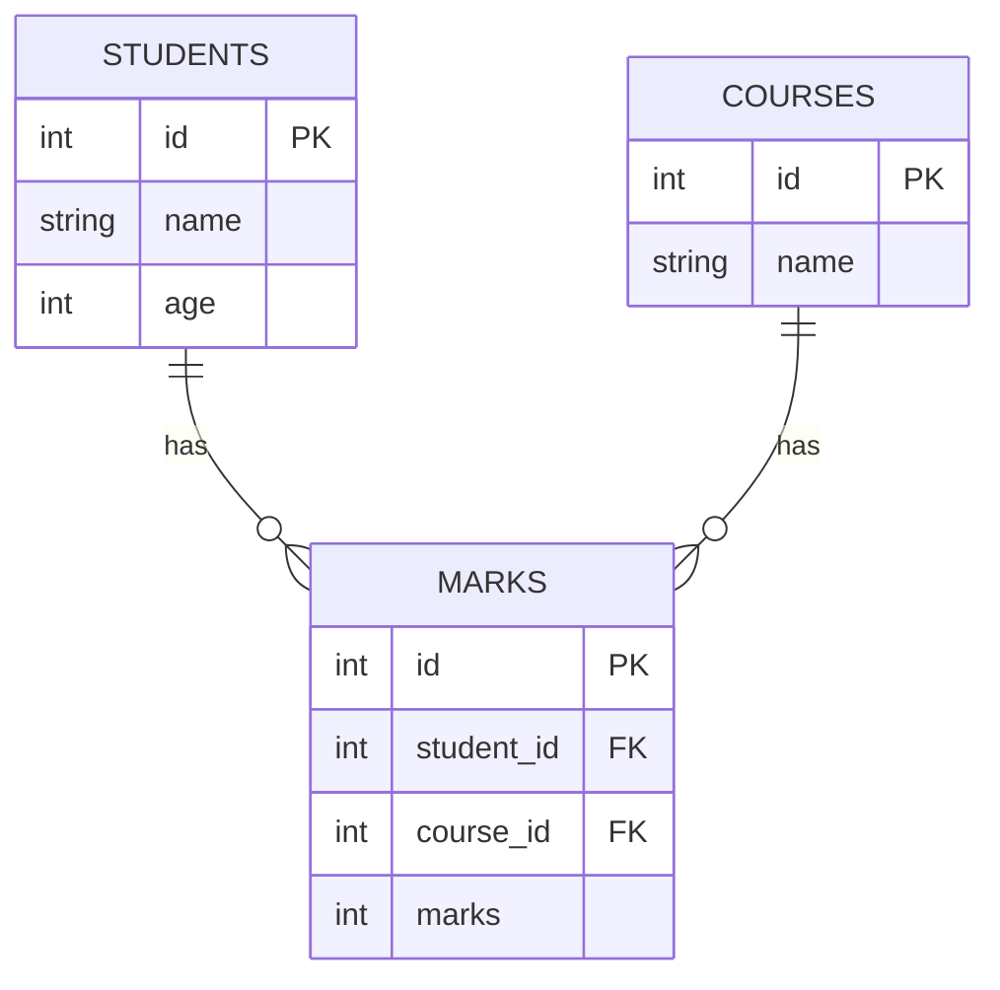

# Understanding SQL JOINs

A **JOIN** in SQL lets us combine rows from multiple tables by matching related columns (like a key lookup between sheets). In simple terms, it’s like merging two lists of information on a common field. For example, if one table lists students and another lists their marks, a join can link each student’s name with their mark. As Atlassian explains, *“A JOIN is a SQL instruction in the FROM clause… used to identify the tables you are querying and how they should be combined”*. This guide uses example tables (*Students*, *Courses*, *Marks*) to show why joins are needed, illustrates the common JOIN types with SQL and SQLAlchemy syntax, and provides practice exercises. (This document is a prerequisite – for applying these queries in code, see `05_relationship_queries.py`.)

## Example Tables

We have three tables:

- **Students**: each student has an `id`, `name`, `age`.  
- **Courses**: each course has an `id`, `name`.  
- **Marks**: links students and courses with fields `student_id`, `course_id`, and `marks`.  

Example data:

```
Students
+----+-------+-----+
| id | name  | age |
+----+-------+-----+
| 1  | Rahul | 24  |
| 2  | Priya | 22  |
| 3  | Aman  | 20  |
+----+-------+-----+

Courses
+----+----------+
| id | name     |
+----+----------+
| 1  | Python   |
| 2  | FastAPI  |
+----+----------+

Marks
+----+------------+-----------+-------+
| id | student_id | course_id | marks |
+----+------------+-----------+-------+
| 1  | 1          | 1         | 85    |
| 2  | 1          | 2         | 90    |
| 3  | 2          | 1         | 78    |
+----+------------+-----------+-------+
```



The *Marks* table uses the `student_id` foreign key to refer to a student, and `course_id` to refer to a course. To produce a combined list (e.g. which student scored what in which course), we need SQL JOINs. A join matches rows in the *Students* and *Marks* (or *Courses*) tables by the common key (`Students.id = Marks.student_id`), effectively stitching related data together.

## INNER JOIN

An **INNER JOIN** returns only rows that have matching values in both tables. In plain terms, it shows *only the “linked” records*. 

**Example:** Get each student’s name and their marks (only students who took courses):

```sql
SELECT Students.name, Marks.marks
FROM Students
JOIN Marks ON Students.id = Marks.student_id;
```

This finds rows where `Students.id = Marks.student_id`. The result would be:

```
+-------+-------+
| name  | marks |
+-------+-------+
| Rahul | 85    |
| Rahul | 90    |
| Priya | 78    |
+-------+-------+
```

*(Aman does not appear because he has no entry in *Marks*.)*  

Inner join includes only the *common* entries. As one guide notes, an inner join *“only includes data for the columns that share the same values”*. 

**SQLAlchemy:** Using the ORM, you can express this similarly. For example:
```python
# Using session.query (SQLAlchemy 1.x style)
results = session.query(Student.name, Mark.marks) \
    .join(Mark, Student.id == Mark.student_id) \
    .all()

# Using 2.x select()
stmt = select(Student.name, Mark.marks).join(Mark, Student.id == Mark.student_id)
for student_name, marks in session.execute(stmt):
    print(student_name, marks)
```
If `Student` had a relationship defined as `marks = relationship("Mark")`, we could simplify: `session.query(Student).join(Student.marks)` would infer the `ON Students.id = Marks.student_id` automatically. In general, SQLAlchemy’s `select().join()` is the method to create JOINs.

## LEFT (OUTER) JOIN

A **LEFT JOIN** (or LEFT OUTER JOIN) returns *all rows from the left table*, and the matched rows from the right table. If there’s no match, columns from the right side are `NULL`. 

**Example:** List all students and their marks, including students with no marks:

```sql
SELECT Students.name, Marks.marks
FROM Students
LEFT JOIN Marks ON Students.id = Marks.student_id;
```

Result:

```
+-------+-------+
| name  | marks |
+-------+-------+
| Rahul | 85    |
| Rahul | 90    |
| Priya | 78    |
| Aman  | NULL  |
+-------+-------+
```

(*Aman has `NULL` for marks because there’s no row in *Marks* for him.*)

Left join returns every student, filling in `NULL` when the student has no corresponding mark. This matches the definition: Atlassian explains a left join *“returns all rows from the first table with the matching rows in the consecutive tables. The result is NULL in the consecutive tables when there is no match.”*.

**SQLAlchemy:** Use an **outerjoin** to do a left join:

```python
# 1.x style
results = session.query(Student.name, Mark.marks) \
    .outerjoin(Mark, Student.id == Mark.student_id) \
    .all()

# 2.x style
stmt = select(Student.name, Mark.marks).outerjoin(Mark, Student.id == Mark.student_id)
for student_name, marks in session.execute(stmt):
    print(student_name, marks)
```

SQLAlchemy’s `outerjoin()` (or `join(..., isouter=True)`) produces a LEFT OUTER JOIN.

## RIGHT (OUTER) JOIN

A **RIGHT JOIN** is similar to LEFT JOIN but returns all rows from the *right* table, with `NULL` for missing left-side matches. In our example, a right join on `Students RIGHT JOIN Marks` would list all marks even if the student were absent. 

However, **SQLite does not support RIGHT JOIN**. (In databases like MySQL or PostgreSQL, RIGHT JOIN exists.) Conceptually, one can often rewrite a RIGHT JOIN by swapping the tables and using a LEFT JOIN. MySQL documentation notes that *“RIGHT JOIN works analogously to LEFT JOIN”*, so portability often favors LEFT JOIN.

For example, in a DB that supports RIGHT JOIN:
```sql
SELECT Students.name, Marks.marks
FROM Students
RIGHT JOIN Marks ON Students.id = Marks.student_id;
```
This would show all marks (the right table is *Marks*). In SQLite, to get the same result, you could swap tables:
```sql
SELECT Students.name, Marks.marks
FROM Marks
LEFT JOIN Students ON Students.id = Marks.student_id;
```

## FULL (OUTER) JOIN

A **FULL OUTER JOIN** returns *all rows from both tables*, matching where possible, and `NULL` where there is no match on one side. This means every record from either table appears at least once. 

Notably, **SQLite also lacks FULL OUTER JOIN** support. (Many other systems like PostgreSQL, SQL Server, and MySQL do support it.) In general: 

> “The `FULL JOIN` returns all rows when there is a match in either the left or right table… It returns all matching records from both tables whether the other table matches or not.”

For example, in PostgreSQL you could write:
```sql
SELECT Students.name, Marks.marks
FROM Students
FULL OUTER JOIN Marks ON Students.id = Marks.student_id;
```
This would list Rahul, Priya (with their marks) and Aman (NULL marks), and any marks records without a student (if any existed) with NULL for name. In practice for SQLite, FULL JOIN is often emulated by doing a LEFT JOIN and a UNION with a RIGHT JOIN or simply by separate queries.

## CROSS JOIN

A **CROSS JOIN** produces the Cartesian product of two tables: every combination of rows. There is no matching condition; it pairs each row of the first table with every row of the second. 

**Example:** Pair every student with every course:

```sql
SELECT Students.name, Courses.name
FROM Students
CROSS JOIN Courses;
```

Result (6 rows for 3 students × 2 courses):

```
+-------+----------+
| name  | name     |
+-------+----------+
| Rahul | Python   |
| Rahul | FastAPI  |
| Priya | Python   |
| Priya | FastAPI  |
| Aman  | Python   |
| Aman  | FastAPI  |
+-------+----------+
```

As noted by Atlassian, *“a Cross Join would result in a table with all possible combinations of your tables’ rows together”*. Use CROSS JOIN with caution, as the result can grow large.

In SQLAlchemy ORM, a CROSS JOIN can be done by joining with a constant condition. For example, to use `session.query()`, you could do something like:
```python
from sqlalchemy import true

results = session.query(Student.name, Course.name) \
    .select_from(Student) \
    .join(Course, true()) \
    .all()
```
This forces no ON condition (`true()` always matches), equivalent to `CROSS JOIN`. In 2.x style, `select(Student.name, Course.name).join(Course, true())` works similarly.

## Exercises

Try writing the SQL for each scenario below, and check the expected output:

**1. Inner join exercise:** List each student’s name and their marks (only students who have marks).

- **Expected SQL:**
  ```sql
  SELECT Students.name, Marks.marks
  FROM Students
  JOIN Marks ON Students.id = Marks.student_id;
  ```
- **Expected output:**
  ```
  +-------+-------+
  | name  | marks |
  +-------+-------+
  | Rahul | 85    |
  | Rahul | 90    |
  | Priya | 78    |
  +-------+-------+
  ```

**2. Left join exercise:** List all students and their marks (include students with no marks).

- **Expected SQL:**
  ```sql
  SELECT Students.name, Marks.marks
  FROM Students
  LEFT JOIN Marks ON Students.id = Marks.student_id;
  ```
- **Expected output:**
  ```
  +-------+-------+
  | name  | marks |
  +-------+-------+
  | Rahul | 85    |
  | Rahul | 90    |
  | Priya | 78    |
  | Aman  | NULL  |
  +-------+-------+
  ```

**3. Cross join exercise:** List every combination of student and course.

- **Expected SQL:**
  ```sql
  SELECT Students.name, Courses.name
  FROM Students
  CROSS JOIN Courses;
  ```
- **Expected output (6 rows):**
  ```
  +-------+---------+
  | name  | name    |
  +-------+---------+
  | Rahul | Python  |
  | Rahul | FastAPI |
  | Priya | Python  |
  | Priya | FastAPI |
  | Aman  | Python  |
  | Aman  | FastAPI |
  +-------+---------+
  ```

Each exercise practices a different JOIN. Recall that a CROSS JOIN (example 3) has no filtering condition and yields all pairs.

**Note:** This guide is a prerequisite introduction. To see these JOINs in action with SQLAlchemy ORM and `select()`/`join()` methods, refer to `05_relationship_queries.py` in this module. 

**Sources:** SQL JOIN definitions and examples were adapted from SQL documentation (e.g. W3Schools, SQL Server docs) and Atlassian’s visual guide. SQLAlchemy join usage is based on the official SQLAlchemy 2.1 documentation.